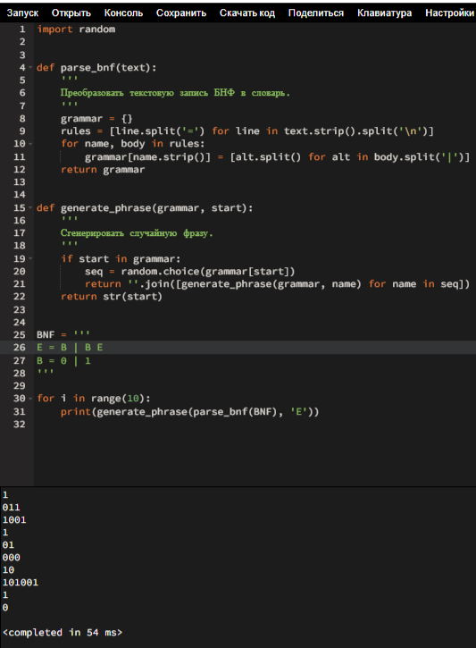

# Практическое занятие №3. Конфигурационные языки

П.Н. Советов, РТУ МИРЭА

Разобраться, что собой представляют программируемые конфигурационные языки (Jsonnet, Dhall, CUE).

## Задача 1

```
{
    groups: std.map(function(i) "ИКБО-" + (i + 1) + "-20", std.range(0, 23)),
    students: [
      {
        age: 19,
        group: "ИКБО-4-20",
        name: "Иванов И.И."
      },
      {
        age: 18,
        group: "ИКБО-5-20",
        name: "Петров П.П."
      },
      {
        age: 18,
        group: "ИКБО-5-20",
        name: "Сидоров С.С."
      },
      {
        age: 19,
        group: "ИКБО-6-20",
        name: "Заморский И.В."
      }
    ],
    subject: "Конфигурационное управление"
  }
```

## Задача 2

```
let Student = { age : Natural, group : Text, name : Text }

let Group = Text

let groupPrefix = "ИКБО-"

let groupYear = "-20"

let makeGroup =
      λ(n : Natural) →
        groupPrefix ++ Natural/show n ++ groupYear

let groups =
      [ makeGroup 1, makeGroup 2, makeGroup 3, makeGroup 4, makeGroup 5
      , makeGroup 6, makeGroup 7, makeGroup 8, makeGroup 9, makeGroup 10
      , makeGroup 11, makeGroup 12, makeGroup 13, makeGroup 14, makeGroup 15
      , makeGroup 16, makeGroup 17, makeGroup 18, makeGroup 19, makeGroup 20
      , makeGroup 21, makeGroup 22, makeGroup 23, makeGroup 24
      ]

let students =
      [ { age = 19, group = makeGroup 4, name = "Иванов И.И." }
      , { age = 18, group = makeGroup 5, name = "Петров П.П." }
      , { age = 18, group = makeGroup 5, name = "Сидоров С.С." }
      , { age = 20, group = makeGroup 6, name = "Заморский И.В." }
      ]

let subject = "Конфигурационное управление"

in  { groups = groups, students = students, subject = subject }
```

Программа для задач 3-5:

```
import random


def parse_bnf(text):
    '''
    Преобразовать текстовую запись БНФ в словарь.
    '''
    grammar = {}
    rules = [line.split('=') for line in text.strip().split('\n')]
    for name, body in rules:
        grammar[name.strip()] = [alt.split() for alt in body.split('|')]
    return grammar


def generate_phrase(grammar, start):
    '''
    Сгенерировать случайную фразу.
    '''
    if start in grammar:
        seq = random.choice(grammar[start])
        return ''.join([generate_phrase(grammar, name) for name in seq])
    return str(start)


BNF = '''
E = a
'''

for i in range(10):
    print(generate_phrase(parse_bnf(BNF), 'E'))
```

## Задача 3

BNF = 
```
E = B | B E
B = 0 | 1
```
<picture>
  <source media="(prefers-color-scheme: dark)" srcset="2024-11-12_11-41-52.png">
  <source media="(prefers-color-scheme: light)" srcset="2024-11-12_11-41-52.png">
  
</picture>

## Задача 4

BNF = 
```
E = P | C
P = ( E ) | ()
C = { E } | {}
```
<picture>
  <source media="(prefers-color-scheme: dark)" srcset="2024-11-12_11-54.png">
  <source media="(prefers-color-scheme: light)" srcset="2024-11-12_11-54.png">
  
</picture>

## Задача 5

BNF = 
```
E = T | E "|" T
T = F | T "&" F
F = "~" F | "(" E ")" | VAR
VAR = x | y | z
```

## Полезные ссылки

Configuration complexity clock: https://mikehadlow.blogspot.com/2012/05/configuration-complexity-clock.html

Json: http://www.json.org/json-ru.html

Язык Jsonnet: https://jsonnet.org/learning/tutorial.html

Язык Dhall: https://dhall-lang.org/

Учебник в котором темы построения синтаксических анализаторов (БНФ, Lex/Yacc) изложены подробно: https://ita.sibsutis.ru/sites/csc.sibsutis.ru/files/courses/trans/LanguagesAndTranslationMethods.pdf

Полезные материалы для разработчика (очень рекомендую посмотреть слайды и прочие ссылки, все это актуально и для других тем нашего курса): https://habr.com/ru/company/JetBrains-education/blog/547768/
